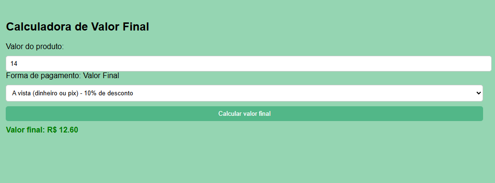

# calcuradora-desconto
A página funciona pegando o valor digitado pelo usuário e a forma de pagamento escolhida. Quando o botão é clicado, o JavaScript faz o cálculo do valor final conforme a opção selecionada. O HTML mostra os campos e o resultado, enquanto o CSS deixa tudo organizado e bonito. Assim, o navegador exibe o valor final já calculado na tela.

Essa página foi criada no Visual Studio Code usando três arquivos principais:
index.html → estrutura da página
style.css → cores e aparência
script.js → cálculos e funcionamento

O HTML é responsável por montar o que aparece na tela.

O CSS deixa a página bonita e organizada, por exemplo:
Fundo verde claro
Painel centralizado
Botão colorido
Texto bem alinhado

O JavaScript é responsável por fazer a conta quando o usuário clica no botão.
Exemplo:
À vista = desconto
Parcelado = sem desconto
Pix = desconto maior

Imagem do projeto:

## Como clonar o projeto 
No terminal do VS Code digite:

https://github.com/biancapaulista167/calcuradora-desconto.git

No GitHub Desktop:

https://github.com/biancapaulista167/calcuradora-desconto.git

#Desenvolvido por Bianca - Turma de Tecnologia em Informática para internet (matutino) - Senac DF 
